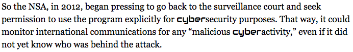

# Cyberextension

Chrome extension to change the font of any occurrence of "cyber" to something more appropriately futuristic.

Doesn't work on some sites (like GitHub) that have restrictive Content Security Policies about fonts.

[Download the CRX file](https://github.com/veltman/cyber/blob/master/cyber.crx?raw=true)

